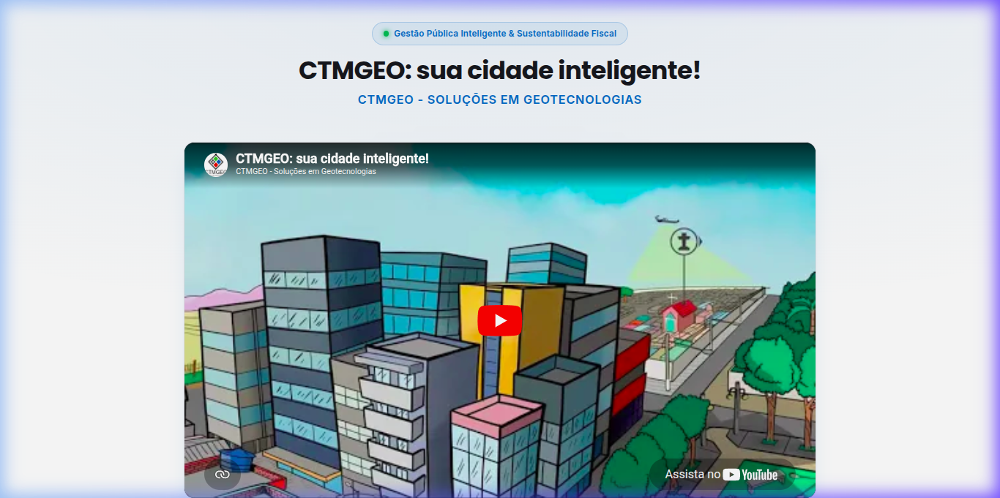
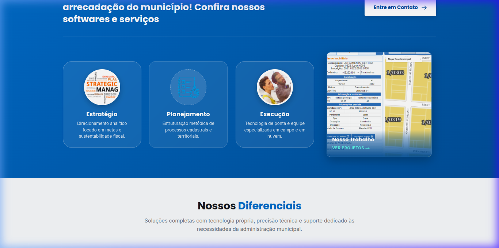
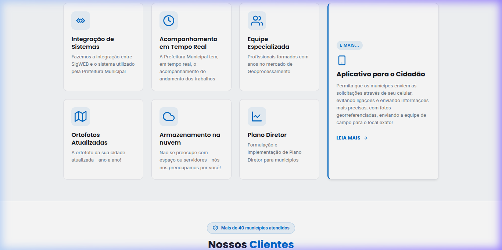
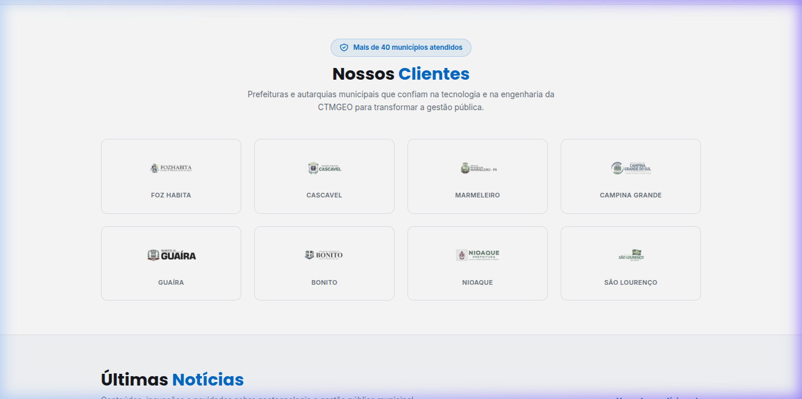
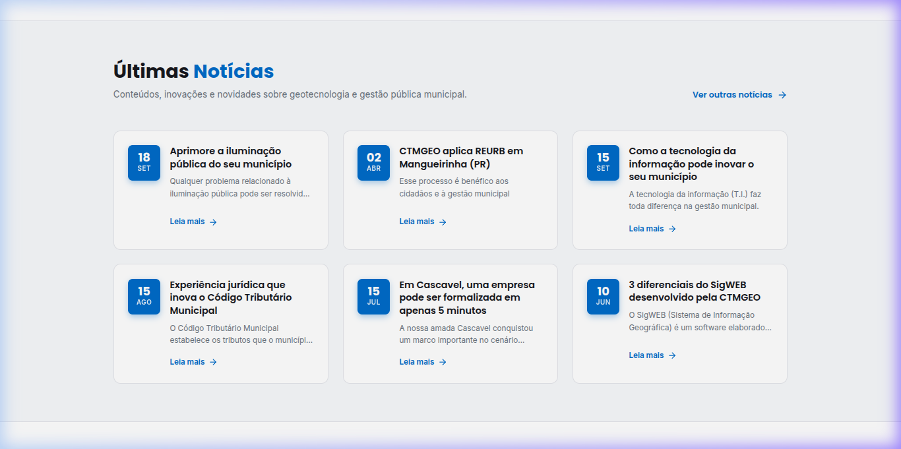
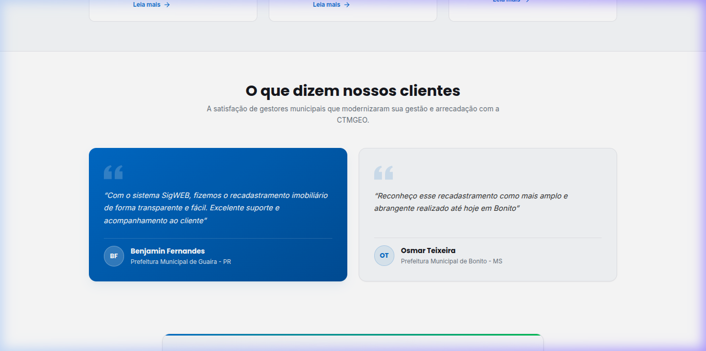
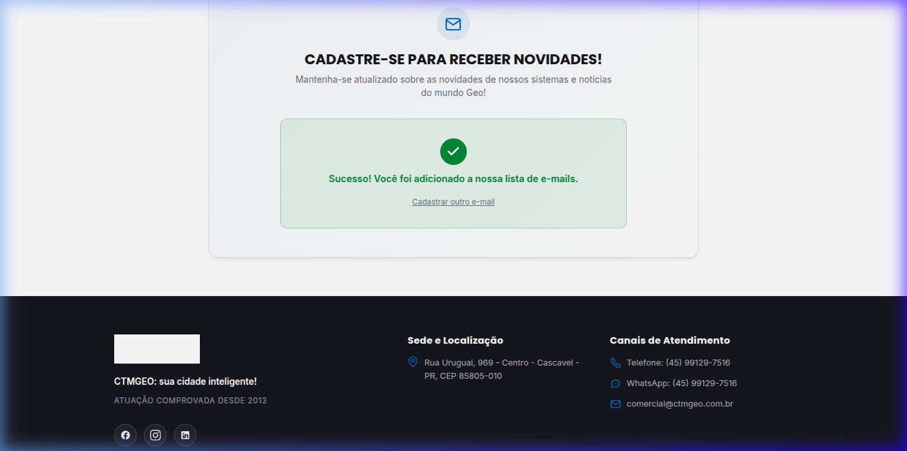
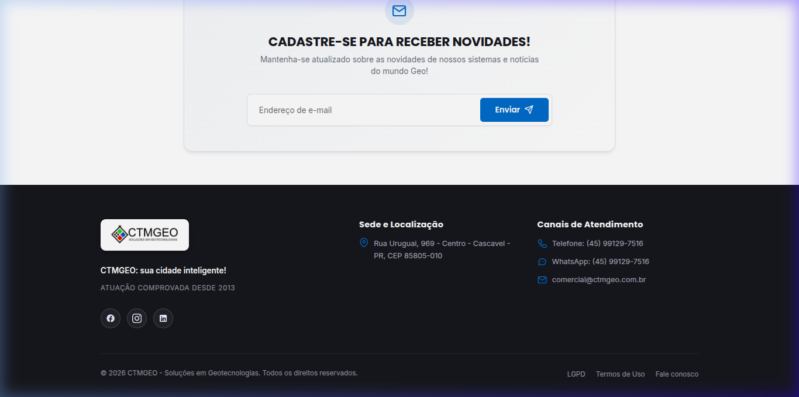
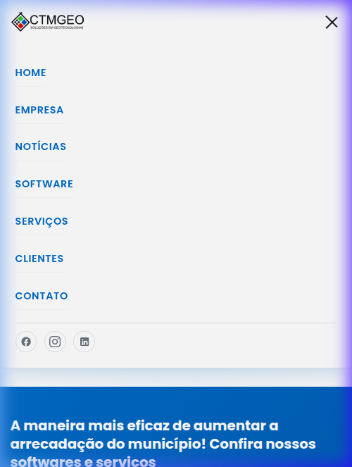

# CTMGEO — Soluções em Geotecnologias

> **Landing Page Institucional Moderna & Clean** desenvolvida com **Next.js 15 (App Router)**, **React 19**, **TypeScript** e **CSS Modules**, concebida como uma solução de alta qualidade técnica e visual para apresentação em processo seletivo / entrevista de emprego.

[](https://nextjs.org/)
[](https://react.dev/)
[](https://www.typescriptlang.org/)
[](https://github.com/css-modules/css-modules)
[](LICENSE)

---

## 🏛️ Sobre a CTMGEO e o Contexto de Negócio

A **CTMGEO** é uma empresa de engenharia especializada em tecnologia da informação e geoprocessamento, sediada em Cascavel (PR) e com atuação nacional desde **2013**. Seu modelo de negócio é **B2G (Business to Government)**, fornecendo serviços de engenharia e seu principal produto: o **SigWEB** — um Sistema de Informação Geográfica em nuvem desenvolvido sob medida para administrações municipais.

### Proposta de Valor Central
- **Aumento de Arrecadação:** A maneira mais eficaz de ampliar a receita tributária (como IPTU e ITR) de forma justa e transparente por meio do recadastramento imobiliário e territorial.
- **Solução Ponta a Ponta:** Não vende apenas software; realiza o trabalho de campo especializado (imageamento aéreo, ortofotos atualizadas, vetorização cadastral) que alimenta o sistema.
- **Autoridade Comprovada:** Mais de **40 municípios atendidos** em múltiplos estados brasileiros (PR, MS, PB, MG, etc.).

---

## ✨ Objetivo do Redesign

O site original possuía uma arquitetura visual legada. O objetivo deste projeto foi **elevar substancialmente o padrão de design**, criando uma interface **clean, elegante e contemporânea**, transmitindo autoridade governamental e inovação técnica:

1. **Estética Clean & Minimalista:** Espaçamento harmônico, respiros generosos e redução de ruídos visuais.
2. **Tipografia Sofisticada:** Combinação de `Poppins` (geométrica e imponente para títulos) e `Inter` (clareza e legibilidade superior para textos técnicos).
3. **Fidelidade Total ao Conteúdo:** 100% dos textos, serviços, notícias reais, depoimentos de clientes e dados de contato foram preservados rigorosamente sem alterar a verdade dos fatos.
4. **Semântica e Acessibilidade (WCAG AA):** Foco visível em elementos interativos, labels descritivos em formulários, hierarquia correta de headings e textos alternativos (`alt`) em todas as imagens.
5. **Experiência Mobile First:** Adaptação fluida e nativa de 320px até resoluções ultrawide (1440px+), com menu de navegação mobile moderno e acessível.

---

## 🧩 Estrutura da Aplicação (Ordem Exata das Seções)

A página foi construída como rota única (`/`), puramente estática e sem dependência de serviços externos em tempo de execução:

1. **Header & Topbar:** Contatos diretos (telefone, WhatsApp, e-mail comercial), botão "Fazer Login", logotipo vetorizado e menu de navegação responsivo.
2. **Hero Section:** Título institucional *"CTMGEO: sua cidade inteligente!"*, subtítulo e player de vídeo institucional do YouTube embutido em moldura 16:9 de alta definição.
3. **Banner CTA Institucional:** Destaque para os 3 pilares metodológicos (**Estratégia**, **Planejamento** e **Execução**) e card interativo *"Nosso Trabalho"*.
4. **Nossos Diferenciais:** Grid com 6 cards técnicos (com ícones SVG monocromáticos) e card lateral de destaque para o **GeoCidadão** (*"Aplicativo para o Cidadão"*).
5. **Nossos Clientes:** Selo de autoridade em destaque (*"Mais de 40 municípios atendidos"*) e grid com brasões municipais oficiais (Cascavel, Guaíra, Bonito, Campina Grande, Foz Habita, Marmeleiro, Nioaque e São Lourenço).
6. **Últimas Notícias:** 6 publicações reais com badge azul estilizado de dia/mês e resumos objetivos.
7. **Depoimentos de Clientes:** Citações autênticas de gestores municipais (Prefeituras de Guaíra - PR e Bonito - MS) em cards com aspas decorativas.
8. **Newsletter:** Formulário com validação client-side acessível e feedback de sucesso instantâneo gerenciado no estado local do React.
9. **Footer:** Rodapé institucional escuro (`#16181D`), com endereço completo, múltiplos canais de contato, links para redes sociais, compliance LGPD e termos de uso.

---

## 📸 Demonstração Visual do Sistema (Screenshots)

Confira abaixo as capturas reais da aplicação em funcionamento:

### 🖥️ Visão Desktop

#### 1. Header, Topbar & Hero Section (Vídeo Institucional 16:9)


#### 2. Banner CTA & Pilares Metodológicos (Estratégia, Planejamento, Execução e Nosso Trabalho)


#### 3. Nossos Diferenciais & Destaque GeoCidadão (App para o Cidadão)


#### 4. Clientes Atendidos (Mais de 40 municípios e Brasões Oficiais)


#### 5. Últimas Notícias & Blog Institucional (Badges de Data)


#### 6. Prova Social & Depoimentos de Gestores Municipais (Guaíra e Bonito)


#### 7. Newsletter Interativa com Faixa "Fique ligado!" e Estado de Sucesso


#### 8. Rodapé Institucional com Logotipo em Cores Autênticas e Aviso Legal


---

### 📱 Experiência Mobile First

#### 9. Menu Gaveta Responsivo e Adaptação Fluida para Telas Menores


---

## 🛠️ Stack Tecnológica & Padrões de Código

- **Framework:** [Next.js 15](https://nextjs.org/) (App Router)
- **Biblioteca Base:** [React 19](https://react.dev/)
- **Linguagem:** [TypeScript](https://www.typescriptlang.org/) (Strict Mode)
- **Estilização:** CSS puro via **CSS Modules** (zero frameworks utilitários como Tailwind ou UI Kits externos, garantindo controle milimétrico do layout)
- **Fontes:** Google Fonts otimizadas pelo Next.js (`next/font/google`) sem requisições em tempo de execução
- **Imagens:** Otimizadas via `next/image`
- **Ícones:** SVGs inline puros (sem fontes de ícones pesadas)
- **Dados:** Arquitetura desacoplada com constantes isoladas em `/data/*.ts`
- **Linting:** ESLint 9 com regras oficiais Next.js (0 erros, 0 avisos)

---

## 📂 Arquitetura de Pastas

```
CTMGEO/
├── app/
│   ├── globals.css                # CSS Variables, resets e tokens do design system
│   ├── layout.tsx                 # Metadados SEO, fontes Poppins, Inter & Caveat, layout base
│   ├── page.tsx                   # Composição semântica da landing page
│   ├── icon.png                   # Favicon oficial do navegador
│   └── apple-icon.png             # Ícone para dispositivos Apple
├── components/
│   ├── Header/                    # Topbar, Navbar, menu mobile e redes sociais
│   ├── Hero/                      # Vídeo institucional 16:9 com glow sutil
│   ├── CtaBanner/                 # Banner azul, 3 pilares redondos e card de trabalho
│   ├── DiferenciaisSection/       # Grid de 6 diferenciais + card GeoCidadão
│   ├── ClientesSection/           # Selo de autoridade e grid de brasões
│   ├── NoticiasSection/           # 6 notícias com data em badge e resumos
│   ├── DepoimentosSection/        # Citações de Guaíra e Bonito com aspas decorativas
│   ├── NewsletterForm/            # Formulário acessível com faixa "Fique ligado!" e feedback
│   ├── ScrollEffects/             # Barra de progresso, reveal e voltar ao topo
│   └── Footer/                    # Rodapé escuro com logo autêntico e disclaimer legal
├── data/                          # Camada de dados centralizada (sem hardcode em JSX)
│   ├── empresa.ts
│   ├── diferenciais.ts
│   ├── clientes.ts
│   ├── noticias.ts
│   └── depoimentos.ts
├── docs/                          # Documentação visual e capturas de tela
│   ├── design_system.md
│   └── screenshots/               # Galeria visual do sistema em execução
├── public/
│   ├── favicon.ico
│   ├── icon.png
│   └── img/
│       ├── logo.png
│       ├── clientes/ (brasões oficiais)
│       └── cta/ (ícones e projeto)
├── package.json
├── tsconfig.json
├── next.config.ts
└── README.md
```

---

## 🚀 Como Executar o Projeto Localmente

### Pré-requisitos
- **Node.js** v18.18+ (recomendado Node.js 20+)
- **npm** v9+

### 1. Clonar o Repositório
```bash
git clone git@github.com:ViniciusRuby/CTMGEO.git
cd CTMGEO
```

### 2. Instalar as Dependências
```bash
npm install
```

### 3. Executar o Ambiente de Desenvolvimento
```bash
npm run dev
```
Abra [http://localhost:3000](http://localhost:3000) no seu navegador para ver o resultado em tempo real.

### 4. Build de Produção e Validação Estática
```bash
npm run build
npm run start
```

### 5. Verificação de Qualidade de Código (Lint)
```bash
npm run lint
```
> O projeto foi validado com **zero erros e zero avisos** de compilação e linting.

---

## 💡 Destaques Técnicos para Apresentação na Entrevista

Caso você seja questionado(a) sobre a arquitetura e decisões de engenharia:

1. **Por que CSS Modules em vez de Tailwind?**
   Demonstra domínio pleno do CSS nativo (CSS Variables, Flexbox, CSS Grid, media queries, manipulação de pseudo-elementos e keyframes), resultando em classes isoladas por componente, zero vazamento de estilos e sem dependências pesadas de terceiros.
2. **Separação entre Dados e Apresentação:**
   Nenhum texto visível está hardcoded dentro do JSX dos componentes. Todos os dados residem na pasta `/data/`, facilitando no futuro a migração para uma API REST, GraphQL ou CMS headless (como Strapi ou Sanity) sem alterar uma única linha de layout.
3. **Performance e Core Web Vitals:**
   Página 100% renderizada estaticamente em tempo de build (`○ Static`), sem requisições HTTP adicionais em runtime, fontes servidas localmente e imagens com atributos de dimensão e renderização otimizada.
4. **Acessibilidade Inclusiva (A11y):**
   Utilização de tags semânticas estruturais (`<header>`, `<nav>`, `<main>`, `<section>`, `<article>`, `<figure>`, `<footer>`), contrastes aprovados pela WCAG AA e formulário com label acessível via leitor de telas.

---

## 👤 Autor

Desenvolvido por **Lucas Alves Rubira (ViniciusRuby)**
- **Perfil GitHub:** [@ViniciusRuby](https://github.com/ViniciusRuby)
- **Repositório:** [https://github.com/ViniciusRuby/CTMGEO](https://github.com/ViniciusRuby/CTMGEO)

---

## ⚖️ Aviso Legal & Direitos de Marca

Este projeto é um **redesign conceitual independente para portfólio**, desenvolvido com o objetivo exclusivo de demonstrar proficiência técnica em engenharia de software front-end e design de interfaces modernas para apresentação profissional.

- **Autoria do Redesign:** [Vinícius Rubira](https://github.com/ViniciusRuby)
- **Marca e Direitos Originais:** Todos os direitos de propriedade intelectual, patentes de software, logomarca e conteúdos institucionais pertencem integralmente à **[CTMGEO — Soluções em Geotecnologias](https://www.ctmgeo.com.br)**.
- **Website Oficial da Empresa:** [https://www.ctmgeo.com.br](https://www.ctmgeo.com.br)

---

## 📄 Licença

Este projeto está sob a licença **MIT** — veja o arquivo [LICENSE](LICENSE) para detalhes.
